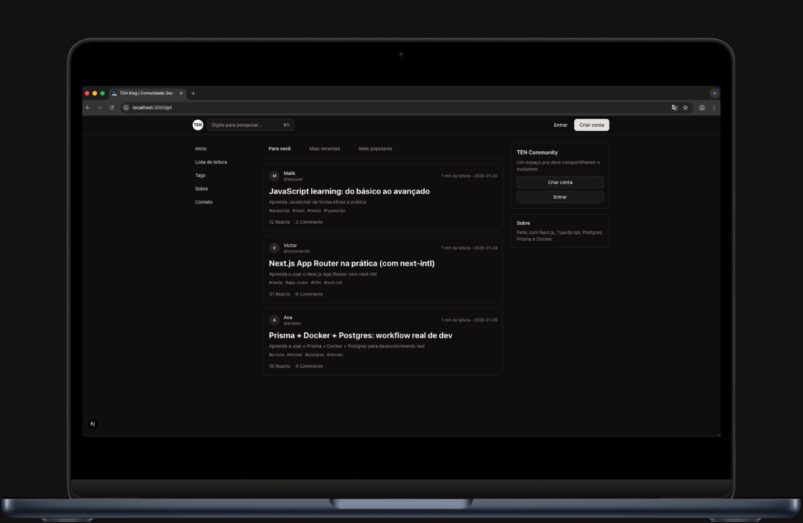

<h1 align="center" id="header">
  Blog Post - Full Stack Application (NextJS)
</h1>

<p align="center">
  
  
  
  
  
  
</p>

<p align="center">
  Modern full-stack blog platform built with Next.js, featuring Drizzle ORM, Better-Auth authentication, Redis (Cache service), internationalization, and containerized deployment.
</p>

---

<h2 id="stack">
  Tech Stack
</h2>

<p>
 

 

 


</p>

### Core Technologies

- **TypeScript** - Type-safe development
- **React** - Latest React features
- **Next.js** - React framework with App Router
- **PostgreSQL** - Robust relational database
- **Tailwind CSS** - Utility-first CSS framework
- **Docker** - Containerized deployment

### Features & Integrations

- **Authentication System** - Secure user authentication and session management
- **Drizzle ORM** - Type-safe ORM for PostgreSQL
- **Zod & React Hook Form** - Form validation and management
- **Shadcn UI** - Beautiful and accessible components
- **Dark Mode** - Theme switching with Next Themes
- **i18n** - Multi-language support (EN / PT-BR / ES) via Next Intl
- **Nodemailer** - Email functionality
- **Sanitize HTML** - XSS protection for user inputs
- **Rate Limiter Flexible** - API endpoint rate limiting and DDoS protection
- **Sentry** - Error tracking and performance monitoring tool
- **Redis** - In-memory cache layer for session storage and performance optimization

---

<h2 id="prerequisites">
  Prerequisites
</h2>

Before starting, ensure you have the following installed:

- [Bun](https://bun.sh/docs) (v1 or higher) – primary runtime & package manager
- [Docker](https://www.docker.com/) – for containerized development and deployment
- [Git](https://git-scm.com/)

> Optional: [Node.js](https://nodejs.org/) (v22 or higher), if you prefer running the app with Node or using Node-based global tooling.

---

<h2 id="installation">
  Installation & Setup
</h2>

### 1. Clone the Repository

```bash
git clone https://github.com/Victor-Zarzar/blog-post
cd blog-post
```

### 2. Open in your editor (example: Zed Editor)

```bash
zed .
```

### 3. Environment Configuration

Copy the example environment file and configure your credentials:

```bash
cp .env-example .env
```

Then edit `.env` with your actual values. The `.env-example` file contains detailed comments explaining each variable and how to obtain the necessary credentials.

**Key configurations needed:**

- **Database**: PostgreSQL connection string
- **Sentry**: DSN and authentication token from your [Sentry project](https://sentry.io/)
- **Website URL**: Your production domain or `http://localhost:3000` for development

> **Important:** Never commit your `.env` file to version control. It's already in `.gitignore`.

### 4. Install Dependencies

```bash
make install
```

Or manually with bun:

```bash
bun install
```

### 5. Set Up Database

```bash
make db-migrate
```

Or manually:

```bash
bun db:generate
bun db:migrate
```

### 6. Run the automated tests (Isolated Docker container)

```bash
make test
```

Or manually with bun:

```bash
bun test
```

---

<h2 id="usage">
  Usage
</h2>

### Available Commands

View all available Make commands:

```bash
make help
```

### Local Development

Start the development server (port 3000):

```bash
make dev
```

Access the application at `http://localhost:3000`

### Docker Deployment

#### Build and Run

Build the Docker image and start the container:

```bash
make run
```

#### Stop Container

```bash
make stop
```

#### View Logs

```bash
make logs
```

Or directly with Docker:

```bash
docker logs -f blog-post
```

#### Access Container Shell

```bash
make shell
```

#### Clean Environment

Remove containers, images, and build artifacts:

```bash
make clean
```

<h2 id="development">
  Development
</h2>

### Code Linting & Formatting

Check for code issues with Biomejs:

```bash
bun biome check
```

Format all files and apply linting fixes:

```bash
bunx biome format --write
```

This command will automatically format your code according to the project's style rules and fix any auto-fixable linting issues.

### Database Management

```bash
# Generate
bun db:generate

# Create a new migration
bun db:migrate

# Open Drizzle Studio (Database GUI)
bun db:studio
```

### Build for Production

```bash
make prod
```

---

<h2 id="screenshots">
  Screenshots
</h2>

### Project Mockup

<p align="center">
  
</p>

### Project Architecture

<p align="center">
  
</p>

---

<h2 id="deployment">
   Deployment
</h2>

### Vercel (Recommended - Production)

The application is deployed on Vercel for production use.

[](https://vercel.com/new/clone?repository-url=https://github.com/Victor-Zarzar/blog-post)

**Important:** Don't forget to add all environment variables from `.env-example` to your Vercel project settings.

- **CI/CD Pipeline** - `.github/workflows/main.yaml` for automated checks and builds
- **Dependabot** - Monthly dependency updates for GitHub Actions and dependencies

### Docker (Optional - Local Development)

Docker is available as an optional tool for local containerized development:

```bash
docker build -t blog-post:production .
docker run -d -p 3000:3000 --name blog-post-prod blog-post:production
```

---

<h2 id="contributing">
  Contributing
</h2>

Contributions are welcome! Please feel free to submit a Pull Request.

1. Fork the project
2. Create your feature branch (`git checkout -b feature/AmazingFeature`)
3. Commit your changes (`git commit -m 'Add some AmazingFeature'`)
4. Push to the branch (`git push origin feature/AmazingFeature`)
5. Open a Pull Request

---

<h2 id="contributing">Contributing</h2>

1. Fork the project
2. Create your feature branch
3. Commit your changes
4. Push to the branch
5. Open a Pull Request

Report issues at: https://github.com/Victor-Zarzar/blog-post/issues

---

<h2 id="license">License</h2>

This project is licensed under the MIT License - see the [LICENSE](LICENSE) file for details.

---

<h2 id="author">Author</h2>

Victor Zarzar - [@Victor-Zarzar](https://github.com/Victor-Zarzar)

Project Link: [https://github.com/Victor-Zarzar/blog-post](https://github.com/Victor-Zarzar/blog-post)

---
